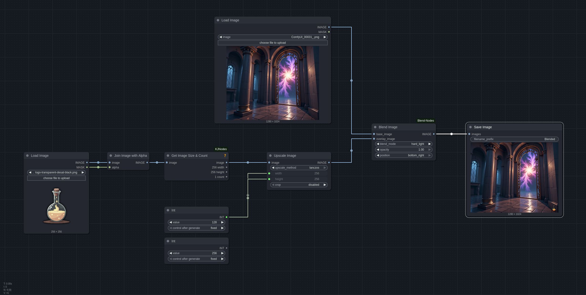
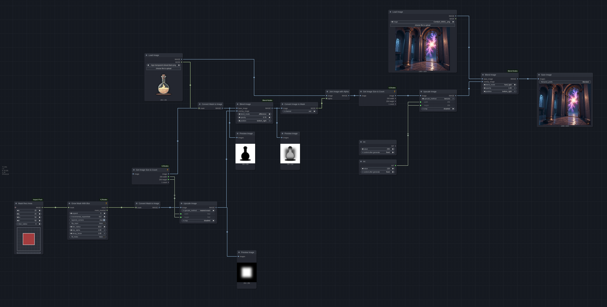

# ComfyUI Blend Image Nodes

Transform your ComfyUI workflows with powerful image blending capabilities! This repository provides a comprehensive set of nodes for blending images using various professional blending modes. Perfect for creating watermarks, overlays, effects, and stunning composite images directly within your ComfyUI pipeline.

Seamlessly combine two images with an extensive selection of blending techniques including normal, multiply, screen, overlay, and many more. Whether you're a digital artist, content creator, or AI enthusiast, these nodes will elevate your image processing workflows.

## ✨ Key Features

- **Professional Blending Modes**: Access to all blending modes from the industry-standard blend-modes library
- **Flexible Positioning**: Anchor overlay images to center, sides, or corners with pixel-perfect control
- **Opacity Control**: Fine-tune the transparency of overlay images for subtle effects
- **Batch Processing**: Process multiple images simultaneously for efficient workflow automation
- **Video Support**: Blend frames in video sequences with the same powerful controls
- **Real-time Progress**: Visual progress bar in ComfyUI keeps you informed during batch operations
- **Easy Integration**: Drop-in compatibility with existing ComfyUI workflows

## Installation

Clone the repository into the ComfyUI `custom_nodes` directory:

```bash
git clone https://github.com/thalismind/ComfyUI-Blend-Nodes.git custom_nodes/ComfyUI-Blend-Nodes
```

## Usage

Dive into the `examples` directory to explore comprehensive workflow examples that demonstrate the full potential of these blend nodes.

### Basic Image Blending

Start with simple image combinations:



### Advanced Mask Blending

Create sophisticated effects with mask-based blending:



### Available Nodes

- `image/Blend Image` - Your go-to node for all blending operations

### Blending Modes

Unlock the full spectrum of professional blending techniques. All blending modes from https://pypi.org/project/blend-modes/ are supported:

- **Soft Light** - Gentle contrast enhancement
- **Lighten Only** - Preserve highlights while blending
- **Dodge** - Brighten and intensify colors
- **Addition** - Additive color blending
- **Darken Only** - Preserve shadows and dark areas
- **Multiply** - Classic darkening blend
- **Hard Light** - High-contrast dramatic effects
- **Difference** - Create unique color inversions
- **Subtract** - Remove colors and create effects
- **Grain Extract** - Extract texture and grain
- **Grain Merge** - Merge texture and grain
- **Divide** - Mathematical color division
- **Overlay** - Versatile contrast enhancement
- **Normal** - Standard alpha blending

## License

This project is licensed under the AGPL-3.0 License. See the [LICENSE](LICENSE) file for details.
